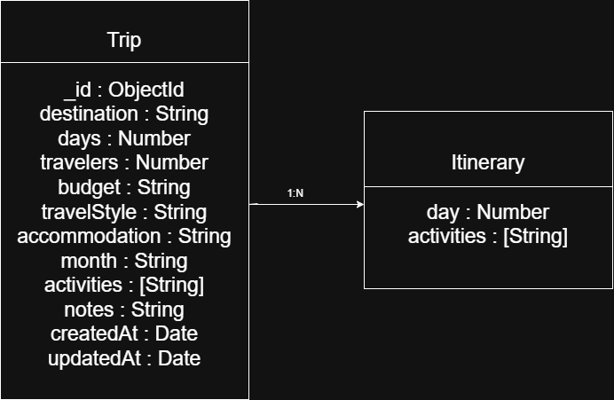

## How to run backend locally

1. Open terminal
2. cd backend
3. npm install
4. Create .env file
5. Add PORT=5000
6. npm run dev
7. Open http://localhost:5000

## Database

This project uses MongoDB Atlas with Mongoose.

### Why MongoDB?

- NoSQL database
- Flexible schema
- Easy integration with Express
- Suitable for REST APIs

## Database Setup

1. Clone repository
2. npm install
3. Create a .env file
4. Add your MongoDB connection string
5. npm start

### Schema Diagram

